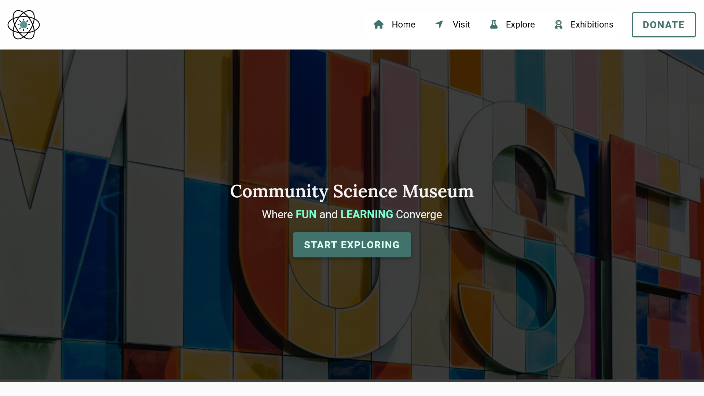

# Community science museum.
https://museum-science.netlify.app




## Description

This project was my semester assignment for Christmas, designed to showcase what we have learned in design, HTML, and CSS. The project began with planning in Figma before transitioning to the coding process. The task was to create a website aimed at the 6-16 age group. It needed to be easy to navigate and highlight exciting events. We were provided with images, but we optimized them ourselves. I chose to use SVGs to create a more playful design.


## Built With

You can list a the tech stack that you've used over here
- Figma 
- HTML 
- CSS

## Getting Started

### Installing

1. Clone the repo:

```bash
git git@github.com:EPetrineLynghaug/Community-Science-Museum.git
```

## Contact

This is where you can leave your social links for people to contact you, such as a LinkedIn profile or 
Github.

[My LinkedIn page](https://www.linkedin.com/in/petrine-lynghaug/)
